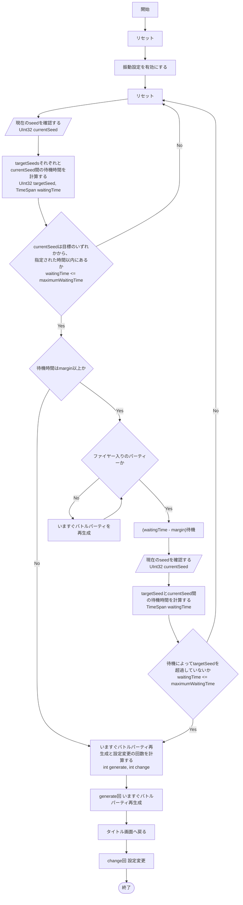

# Sorter

大まかなアイディア 変数名などは変更あるかも

```mermaid
flowchart
    Start["開始"] -->
    
    Reset_first["リセット"] -->
    Enable_vibration["振動設定を有効にする"] -->
    Reset["リセット"] -->
    Get_current_seed[/"現在のseedを確認する\nUInt32 currentSeed"/] -->
    Get_waiting_time["targetSeedsそれぞれとcurrentSeed間の待機時間を計算する\nUInt32 targetSeed, TimeSpan waitingTime"] -->
    
    If_seed_is_close_enough_to_wait{"currentSeedは目標のいずれかから、\n指定された時間以内にあるか\nwaitingTime <= maximumWaitingTime"}
    If_seed_is_close_enough_to_wait -- "Yes" --> If_waitingTime_is_longer_than_5min
    If_seed_is_close_enough_to_wait -- "No" --> Reset

    If_waitingTime_is_longer_than_5min{"待機時間はmargin以上か"}
    If_waitingTime_is_longer_than_5min -- "No" --> Get_number_of_generate_and_setting_changes
    If_waitingTime_is_longer_than_5min -- "Yes" --> If_the_party_contains_Moltres

    If_the_party_contains_Moltres{"ファイヤー入りのパーティーか"}
    If_the_party_contains_Moltres -- "Yes" --> Wait
    If_the_party_contains_Moltres -- "No" --> Regenerate_parties["いますぐバトルパーティを再生成"] --> If_the_party_contains_Moltres

    Wait["(waitingTime - margin)待機"] -->
    Get_current_seed_again[/"現在のseedを確認する\nUInt32 currentSeed"/] -->
    Get_waiting_time_again["targetSeedとcurrentSeed間の待機時間を計算する\nTimeSpan waitingTime"] -->
    
    If_the_previous_waiting_is_not_overtime{"待機によってtargetSeedを超過していないか\nwaitingTime <= maximumWaitingTime"}
    If_the_previous_waiting_is_not_overtime -- "No" --> Reset
    If_the_previous_waiting_is_not_overtime -- "Yes" -->

    Get_number_of_generate_and_setting_changes["いますぐバトルパーティ再生成と設定変更の回数を計算する\nint generate, int change"] -->
    Regenerate["generate回 いますぐバトルパーティ再生成"] -->
    Back_to_title["タイトル画面へ戻る"] -->
    Change["change回 設定変更"] -->

    End(["終了"])
```
